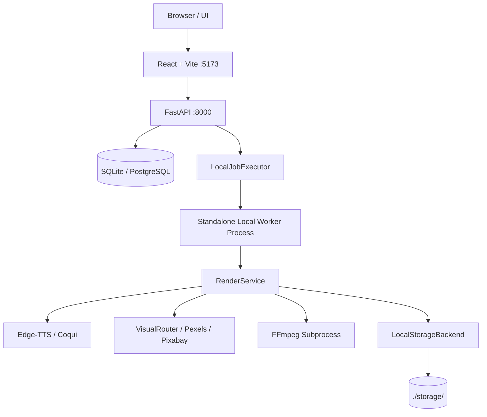

# AutoTube AI — Target Architecture

## 1. Overview & Dual Execution Modes
AutoTube AI is designed as a single codebase supporting two execution topologies:
1. **Local Mode ($0 Local Compute)**: Fully self-contained on developer machine.
2. **Cloud Zero-Cost Beta Mode ($0 Cloud Infrastructure)**: Ephemeral, serverless execution across Render, Neon, Cloudflare R2, and GitHub Actions.

---

## 2. Local Architecture Topology


---

## 3. Cloud Zero-Cost Beta Topology ($0 Operating Cost)
```mermaid
graph TD
    Browser[Browser / UI] --> RenderFE[Render Static Frontend]
    RenderFE --> RenderAPI[Render Free Web Service (FastAPI)]
    RenderAPI --> NeonDB[(Neon Serverless PostgreSQL)]
    RenderAPI --> GHAExec[GitHubActionsJobExecutor]
    GHAExec --> GHA[GitHub Actions Ephemeral Runner]
    GHA --> GHWorker[Worker CLI (--job-id <ID>)]
    GHWorker --> RenderService[RenderService]
    RenderService --> TTS[Edge-TTS Cloud]
    RenderService --> Visuals[VisualRouter / Stock APIs]
    RenderService --> FFmpeg[FFmpeg Subprocess]
    RenderService --> R2Storage[Cloudflare R2 StorageBackend]
    R2Storage --> R2[(Cloudflare R2 Bucket)]
    GHWorker --> NeonDB
    RenderAPI --> NeonDB
    Browser --> RenderAPI
```

---

## 4. Key Architectural Invariants
1. **Worker Decoupling**: FastAPI never starts a background worker inside its lifespan.
2. **Durable Job Creation**: Jobs are persisted and committed to PostgreSQL before dispatching to any executor.
3. **Storage Abstraction**: All media reads and writes route strictly through `StorageBackend` (`LocalStorageBackend` or `S3StorageBackend`). No hardcoded paths in production code.
4. **Tenant Isolation**: All queries enforce `WHERE user_id == user.id`. UUIDs alone are not authorization.
5. **Zero Plaintext Secrets**: OAuth credentials (YouTube tokens) are encrypted with Fernet (`ENCRYPTION_KEY`) at rest.
