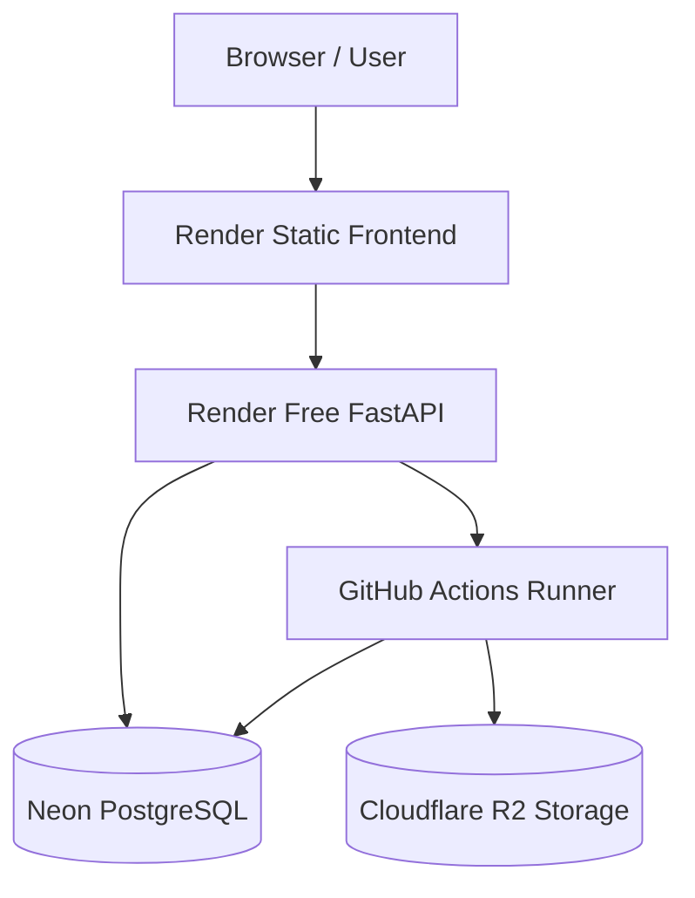

# Cloud Deployment Overview ($0 Beta Architecture)

## Architecture Topology
AutoTube AI achieves a $0/month production deployment using:
1. **Frontend**: Render Static Site (Free, global CDN)
2. **Control Plane / API**: Render Free Web Service (FastAPI)
3. **Database**: Neon Serverless PostgreSQL (Free tier, 0.5 GiB storage, auto-suspend)
4. **Permanent Object Storage**: Cloudflare R2 (Free tier, 10 GB storage, $0 egress fees)
5. **Compute / Render Worker**: GitHub Actions Ephemeral Runners (Free tier, 2,000 min/month on public/private repos)

