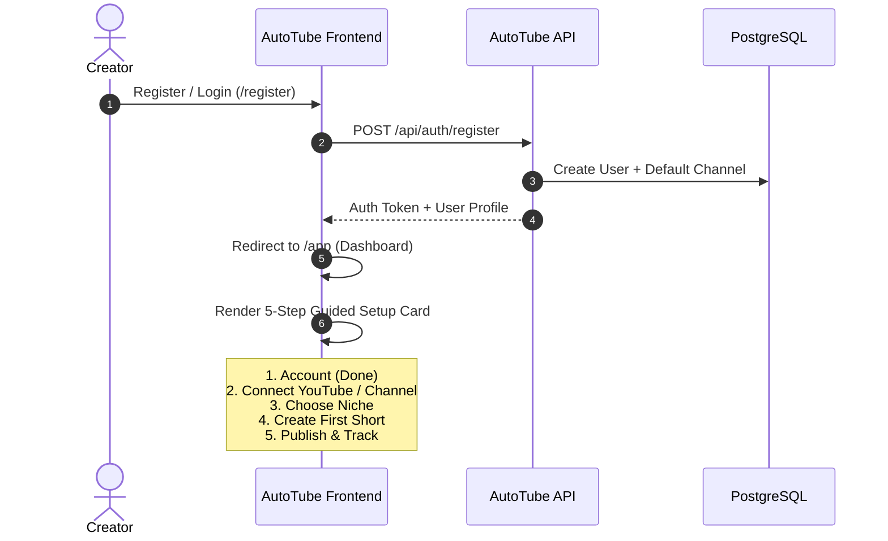
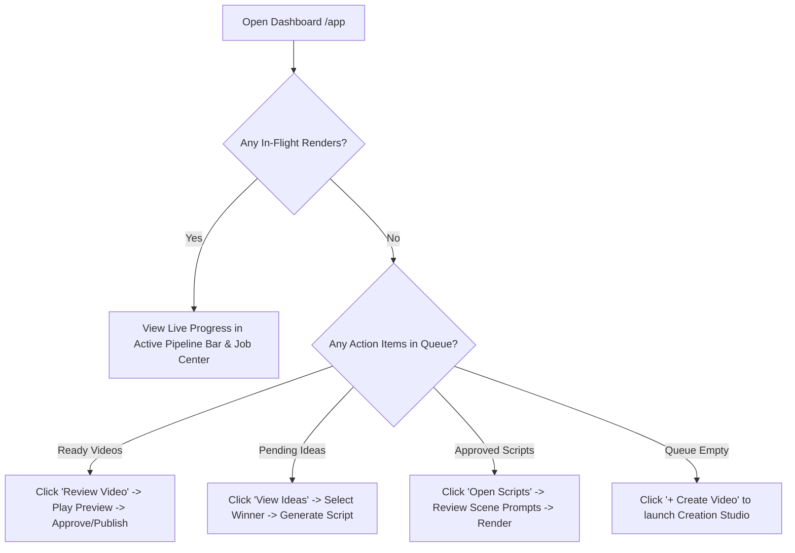
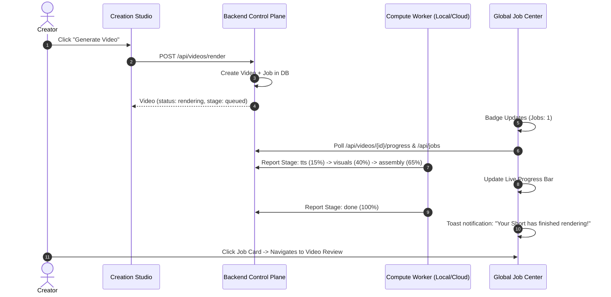

# AutoTube AI — Creator UX Flow & User Journeys

This document models the core workflows and interaction patterns across the AutoTube AI studio.

---

## 1. Flow 1: New User Onboarding & Channel Setup

---

## 2. Flow 2: Daily Creator Command Center Triage

---

## 3. Flow 3: Long-Running Render & Durable Job Tracking

